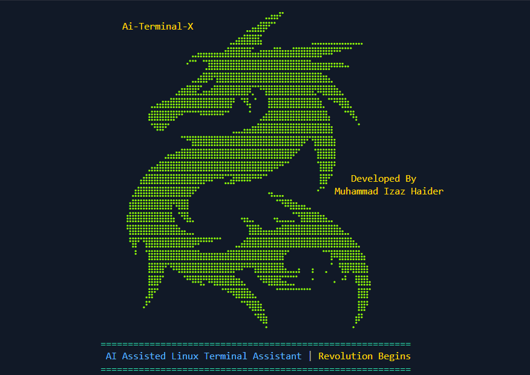
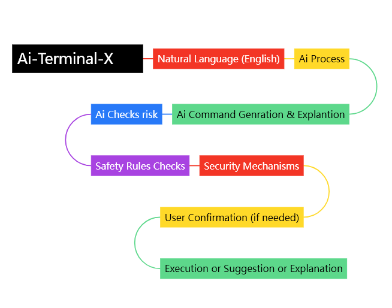

## ⚡ AI-Terminal-X  ( AI-powered  Terminal Assistant for **Linux )**


**Developed by:** Muhammad Izaz Haider

Your AI-powered personal terminal assistant for **Linux** (especially Kali Linux).

Order in plain English — and watch real terminal magic happen instantly! 🪄

### 📚 **Introduction**

AI-Terminal-X is **a game-changing AI-Powered Terminal Assistant** designed to revolutionize the way you interact with your Linux terminal. Whether you're a beginner, an ethical hacker, or a seasoned professional, AI-Terminal-X transforms your daily command-line operations, enhancing productivity and learning.

#### Watch Full Demo LinkedIn:https://www.linkedin.com/posts/muhammad-izaz-haider-091639314_alhamdulilah-proud-to-share-my-latest-project-ugcPost-7324760286094065664-dsAJ

#### Blog Post:https://medium.com/@the-pentrix/ai-terminal-x-ai-powered-intelligent-linux-command-line-copilot-04629dfaf057

### 🔥 **A Powerful Combination of**

* **Linux Terminal (XFCE)** – Reliable command execution
* **AI (Google's Gemini AI)** – Intelligent command generation
* **Python** – Seamless integration of components
* **Cybersecurity/Ethical Hacking** – Focused on security tools and commands
* **Prompt Engineering** – Natural language command input
* **Real-Time Execution** – Instant command execution
* **Safety & Control** – Safe, permission-based execution

### 🔐 **What AI-Terminal-X Does**

AI-Terminal-X is powered by  **Google’s Gemini AI** , making it **exceptionally intelligent** and capable of understanding natural language. This tool is specifically built for  **Kali Linux** , but it can work on any Linux-based terminal. With just a few simple commands, **AI-Terminal-X** can instantly generate accurate terminal commands, run them, and explain their functions — all in seconds.

### ✨ **Key Features**

✅ **AI-generated terminal commands** (Kali/Linux optimized)

✅ **No execution without permission** — you control everything

✅  **Dual-window** : AI conversation + command execution

✅ **Command logging** for easy review and reuse

✅ **Simple text input → real, working output**

✅ **Powered by Gemini 1.5 Flash** – Fast, Accurate, Lightweight

✅ **Made for students, pros, researchers, & enthusiasts**

✅ **Command Suggester** — Suggests related commands based on your input

✅ **Multi-layer risk check** to ensure safe execution of commands

✅ **Customizable aliases** for faster command execution

✅ **Interactive Mode** — Review, edit, or cancel commands before execution

✅ **Real-time feedback and explanations** for commands

✅ **Smart back navigation** between different modes

✅ **Command history** to easily reuse previous inputs

✅ **Efficient learning mode** — Ask questions and get beginner-friendly explanations

✅  **Future-proof** : Voice command integration coming soon

✅ **Secure API integration** for smooth operation

✅ **User-friendly interface** for seamless interaction

### 🔥 **LOGO**



### 🔥 **Built for**


### 🔥 **Work-Flow**



# 🔧 Installation

### 1: 🔹 Must Install Required Modules

```sh

pip install google-generativeai python-dotenv

```

### 2: 🔹 Clone the Repository

```sh

git clone https://github.com/mizazhaider-ceh/Ai-Terminal-X.git

cd Ai-Terminal-X

```

### 3: 🔹 Run the Setup script & ai-terminal-x script

In terminal:

```sh

python setup.py

```

After setup.py run below command

```sh

python ai-terminal-x.py

```

### 3: 🔹 Enter your Gemini API key ~ when prompted

```sh

Done!🚀

```

## 🛠️ Requirements

* Python 3.8+
* Gemini API Key (Get it [here](https://aistudio.google.com/apikey))

### 🔐 Safety and Permissions

Before running any command, **AI-Terminal-X** checks if the command could potentially be harmful to your system. Here's how it works:

1. **Risk Check** : The system checks whether the command might be dangerous.
2. **Permission Check** : The tool will prompt you to confirm execution if needed, ensuring you approve the actions before anything is run.
3. **Security Safeguards** : Built-in security mechanisms prevent harmful commands from being executed.

### 🛠️ Troubleshooting

If you face issues while using  **AI-Terminal-X** , try the following:

1. **"Command not found" error** : Make sure your Gemini API key is set correctly in the `.env` file.
2. **API key-related errors** : Double-check that you've copied your API key properly and that it's active.

For any other issues, feel free to open an issue in the [GitHub repository](https://github.com/mizazhaider-ceh/Ai-Terminal-X/issues).

## 📚 Example Usage

| Input                                       | Generated Command     |
| ------------------------------------------- | --------------------- |
| `Show my public IP address`               | `curl ifconfig.me`  |
| `List all files in the current directory` | `ls`                |
| `Go to the home directory`                | `cd ~`              |
| `Check disk usage`                        | `df -h`             |
| `Display running processes`               | `ps aux`            |
| `Open a file with Nano editor`            | `nano filename.txt` |

## 👨‍💻 Author

**Muhammad Izaz Haider**

* Ethical Hacker | Penetration Tester | Founder of **The Pentrix**
* [LinkedIn](https://www.linkedin.com/in/muhammad-izaz-haider-091639314/) • [GitHub](https://github.com/mizazhaider-ceh) • [PortFolio](https://mizazhaider-ceh.github.io/My-Portfolio/)

## 🌟 Support the Project

If you like  **AI-Terminal-X** , please **⭐ star the repo** and share it with your friends!

Your support helps open-source thrive! 🚀

# 🚀 Let **AI-Terminal-X** Revolutionize Your Terminal Experience!

*"Speak simple. Work smart."*

*"Let AI turn your thoughts into commands!"* ✨
